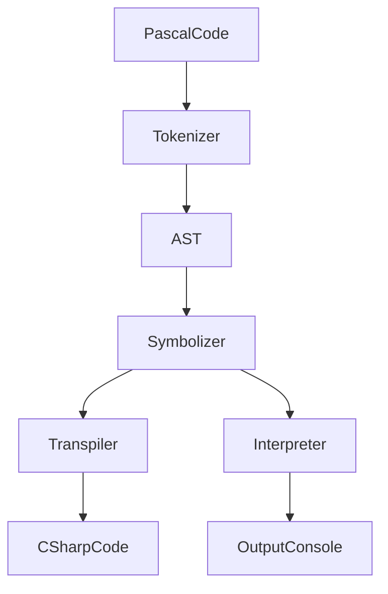

I have always been interested in programming languages even before I knew how to program.  It's been one of the most challenging projects I've worked on so far. I made a compiler and interpreter for pascal that can also transpile to C#.  This compiler is not feature complete.  It's more of a test project, but I have learned a lot from building this as to how programming languages work.

# Features
- An online editor built with blazor and ace.js (see below).
- An offline editor built with WPF.
- Syntax highlighting.
- Error highlighting.
- Error List.
- CSharp Transpiler.
- AST Viewer.
- Output Console.

# How it Works

- The source code is broken down into a list of tokens. Tokens are collections of characters that represent some symbol in the language, such as keywords like program, begin, end. It also include ID tokens which can be the name of the program, variables, or functions. If an unexpected token is found, an error is returned.
- The tokens are then converted into an abstract syntax tree. This data structure groups related tokens into nodes and forms a tree. For example, the token "begin" defines the start of a block node, with various statement nodes between the "begin" and "end" tokens. This ensures the program has the proper structure.
- The symbolizer ensures that the program is valid. For example, ensuring that a variable has been declared before being called or that types and functions being used have been properly defined. It uses tables to define what symbols are available to the program throughout different parts of the syntax tree. At this point, we should be certain that the pascal program is correct or that any errors are displayed to the user.
- The implementation depends on whether we are using the interpreter vs the transpiler, but the process is the same. The AST is read and each node is processed, either by converting it into it's C# code counter-part or by actually executing it via .NET.

# Try it out online!
<link href="css/app.css" rel="stylesheet" />

<app>Loading...</app>

I even built an IDE for the compiler I created that shows errors and output.  It also shows the node tree and the csharp output.

